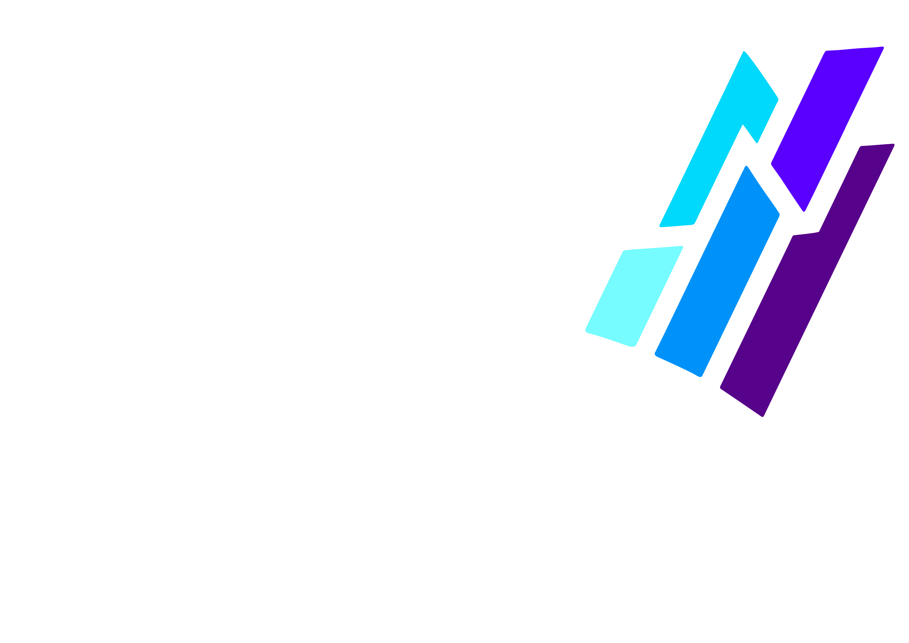

      <h1 align="center">Freelancers | فریلنسرز</h1>
      

  <h5>Fullstack app for freelancers with NodeJS, MongoDB, ReactJS, Tailwindcss</h5>
  
In this app there are 3 roles: Freelancer, Owner and Admin. Owner creates projects, Freelancer creates proposals for projects and Admin controls all the process. each role has a panel.
 stack: React, React-Router-DOM, React-Query, React-Hook-Form, Axios, Tailwindcss, etc.

<h2>Features</h2>

Here're some of the project's best features:

*	Incorporating OTP code functionality via Kavehnegar service.
*	Established a mechanism to generate access tokens using refresh tokens
*	Verify users post-sign-in by Admin within the Admin panel.
*	Creating projects within the Owner panel.
*	Generating project proposals within the Freelancer panel,
*	Introduced a feature to sort projects and filter applying "query-string" for categorization
*	Admins efficiently handle user, project, and proposal management tasks within the Admin panel.
*	Dark mode feature to enhance user satisfaction and decrease in eye strain complaints.

---

<h2>Screen Shots</h2>
